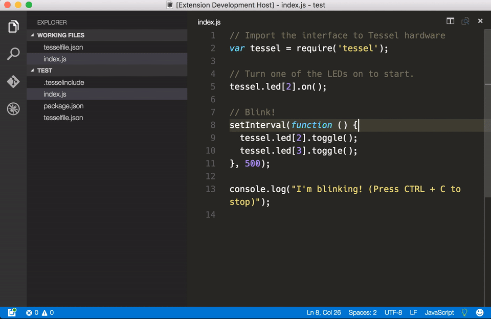

# VSCE Tessel

vsce-tessel is a visual studio code extention for manage your Tessel 2, it's a wrapper around [t2-cli](https://github.com/tessel/t2-cli)

I build this extention for avoiding switching to the terminal, in fast loop workflow.

## Features

VSCE tessel supports most of the main commands provided by [t2-cli](https://github.com/tessel/t2-cli)

## Requirements

you need to have [t2-cli](https://github.com/tessel/t2-cli) installed.

## Extension Settings

## Known Issues

After call the run commands the board needs to be resetted for quit the current script.

## Release Notes

### 1.0.0

Initial release